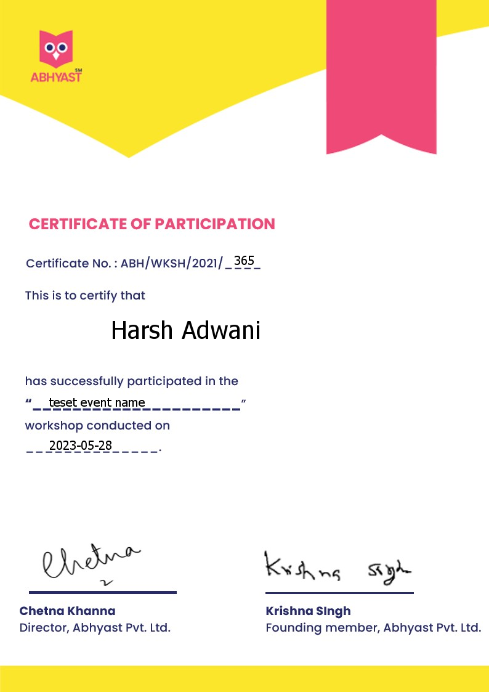

# get-cert
NodeJs server project to automatically generate and send certificates to multiple recipients.   Uses Canvas library.   Install dependencies with `npm i` before running the server with `nodemon main.js`.   

- API expects input in the following format -    

- Provided recipients will receive certificates in PNG format by default, as shown below.   

